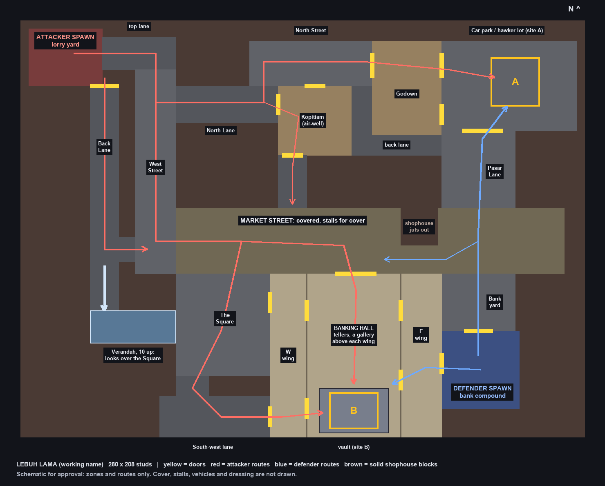

# Lebuh Lama: an old-town Search and Destroy map

Status: approved by the owner on 2026-10-07 and built the same day, as
`src/server/Maps/LebuhLama.luau`. What was built differs from the first
design in a few places, each marked "As built" below. The schematic is the
first design.

"Lebuh Lama" (Old Street) is a working name.

## What it is

A two-site Search and Destroy map set in an invented Malaysian heritage
quarter at dusk: a covered market street in the manner of Kuala Lumpur's
Chinatown, with George Town style shophouses, five-foot ways and back lanes
around it, and an old colonial savings bank in the middle.

## Decisions the owner made (2026-10-07)

- One blended old town, not KL or Penang alone. No real street is copied.
- The central building, which holds site B, is an **old colonial bank**.
- **Dusk, with lanterns lit.**
- **No tunnels.** The bazaar is the covered market on the main street.

## What is taken from Savings Vault, and what is not

Taken: the way it plays. Attackers start in the far north-west corner and
defenders beside the central building in the south-east. Site B is inside
that building; site A is an open car park in the north-east. A wide street
runs between them, with back alleys on the west and a first-floor perch over
the western open ground. The footprint is about the same: the reference
measures roughly 91 m by 68 m, and this map is 280 by 208 studs at 3 studs to
the metre.

Not taken: its walls are not traced, and none of its meshes, textures or
names are used. Every rectangle in this plan was drawn new on a 2 stud grid.

## Layout

X runs west to east, Z north to south, in studs. The map is not mirrored.

| Zone | Rectangle (x1, z1, x2, z2) | What it is |
|---|---|---|
| Attacker spawn | -134, -98, -98, -70 | A lorry yard |
| Top lane | -98, -94, -62, -78 | Out of the yard, east |
| West Street | -82, -78, -62, 22 | North to south, down to the market |
| North Lane | -62, -70, -12, -52 | East from West Street to the kopitiam |
| North Street | -26, -92, 34, -70 | East to the godown |
| Kopitiam | -12, -70, 24, -36 | A coffee shop round an open air-well |
| Middle lane | -12, -36, 2, -10 | From the kopitiam down to the market |
| Back lane | 24, -70, 34, -46 and 24, -46, 68, -36 | A narrow flank into Pasar Lane |
| Godown | 34, -92, 68, -46 | A market storehouse, the short way into A |
| Car park (site A) | 68, -92, 134, -48 | A car park that doubles as a hawker lot |
| Pasar Lane | 68, -48, 104, -10 | Between the car park and the market |
| Market Street | -62, -10, 128, 22 | The covered market; stalls are the cover |
| The Square | -62, 22, -16, 72 | Open ground west of the bank |
| South-west lane | -70, 82, -16, 102 | Round the back to the bank's side door |
| Back Lane | -112, -70, -98, 40 | West alley, with stairs up at its south end |
| Passage | -98, -34, -82, -22 | From Back Lane through to West Street |
| Verandah | -112, 40, -62, 56, 10 up | Looks east over the Square |
| Bank | -16, 22, 68, 102 | Hall in the middle, a wing each side |
| Vault (site B) | 8, 78, 42, 100 | At the south end of the hall |
| Bank yard | 68, 22, 104, 50 | Between the defenders and the market |
| Defender spawn | 68, 50, 106, 88 | The bank's rear compound |

One shophouse (48, -10, 66, 8) juts into Market Street, so the street is 14
wide in front of the bank's east end and nobody sees its whole length.

As built:

- The passage from Back Lane to West Street is further north than drawn. Where
  it was drawn it lined up with the market, and from Back Lane one could see
  180 studs down it.
- Doors that lined up were moved apart: the bank's west wing door into the
  hall, the kopitiam's side door, and the two gates either end of Pasar Lane.
- The market's stalls stand across the street, each with a board of goods
  behind its counter, and no two in line.
- After these the longest straight sightline on the map is 116 studs, down
  West Street. `tools/maps/plan.py` reports it.

### Routes

Attackers have four ways out of their yard:

1. North: top lane, North Lane, North Street, through the godown, into A.
2. Middle: North Lane, through the kopitiam, down the middle lane to the
   market; or on through the back lane to Pasar Lane and A's south gate.
3. Main: West Street to the market, then the bank's front door to B.
4. West: Back Lane, then either through to West Street and the Square, or up
   the stairs to the verandah. From the Square, the bank's two west doors,
   the second by way of the south-west lane.

Defenders have three:

1. West through the east wing into the hall and the vault.
2. North through the bank yard, across the market, up Pasar Lane to A.
3. West along the market to meet attackers at the bank front.

### Running distances, at 20 studs a second

| | to A | to B |
|---|---|---|
| Attackers | about 265 studs, 13 s | about 300 studs, 15 s |
| Defenders | about 150 studs, 7 s | about 70 studs, 4 s |

Defenders reach B much sooner than attackers do. That is carried over from
the reference, where the defenders start against the bank, and is the first
thing to judge once it can be played.

### The bank

The hall is 46 by 80 with teller counters down its middle. Each wing is a
side aisle 18 to 20 wide with two doors into the hall and a stair to a
gallery 10 up that looks over the hall. Doors in: the front (20 wide, under a
portico), two on the west from the Square and the south-west lane, one on the
east from the defenders' compound. The floor is level with the street.

## How it is built

Like every other map here: one layout table, `src/server/Maps/LebuhLama.luau`,
built by `MapBuilder`. Structure comes from `fill` (the solid is the
complement of the open rectangles above, so walls cannot leave gaps), with
`doors` listed for `tools/maps/walls.py` to check.

Everything is made of Roblox parts and built-in materials, so it arrives
through Rojo with nothing to import by hand. Small cover that already has a
model (crates, barriers) keeps using it.

`MapBuilder` gains four things, each small and usable by other maps:

- **Wedge shape**, for pitched tile roofs and awnings.
- **Signboards**: a board with writing on it, for shop signs. Roblox draws
  Malay, English and Chinese text itself, so no images are needed.
- **Decoration flag**: a box that is seen but never collides or stops a shot,
  so lanterns, shutters and trim cannot snag a player or eat a bullet.
- **Sloping scenery**: a ramp marked as decoration, for the market's glass
  roof and its rafters.

The map tools (`plan.py`, `walls.py`, `view.py`) learn the same four. Two
more changes to them came out of this map:

- `walls.py` tells a doorway from the room behind it by width, so a door into
  a room under 30 studs wide (the vault) is no longer missed; and a box marked
  `freestanding` (a column, a post, a rack) is not read as a wall with
  doorways round it.
- `view.py` draws wedges, cylinders and balls as they are, and can draw part
  of a map as it stands, roofs on, from any side (`--full --crop --yaw`).

Lanterns glow by material; only a few dozen carry a real light, to keep the
map cheap on phones.

### Dressing kit

Written once as functions in the map module and reused:

- **Shophouse front**: a shop at ground level (roller shutter, folding
  timber doors, or open and lit), shuttered windows above, a pitched
  terracotta roof, a signboard in Malay and often a hanging one in Chinese.
  As built, only the row on the market's north-west side has a five-foot way
  on piers; the row east of it has the parked minibus against it instead.
- **Market canopy**: a high translucent roof on steel posts over the street,
  strung with lanterns.
- **Stall**: a cart or trestle with an awning and stools. Stalls are the
  market's cover, at crouch and standing heights.
- **Vehicles**: a parked lorry, cars and trishaws, as cover.
- **Bank**: portico with columns, teller counters, a round vault door.
- **Backdrop** beyond the walls: more shophouse roofs, a hill, a temple roof
  in the distance as a landmark.

### Names and culture

Shop and bank names are invented; no real business, brand or bank is named.
Chinese text is kept to short, common shop words. The temple is scenery only:
no bomb site, fighting space or door is put in a place of worship.

## Two stages

1. **Blockout.** The structure above with plain cover, both sites, spawns and
   doors. Proven with `plan.py` (every spawn and site reachable), `walls.py`
   (no leaks or cracks; doors match the list), `view.py`, the Studio smoke
   test, and a Search and Destroy run of the play test on this map. The owner
   then looks at it and plays it before any dressing is done.
2. **Dressing**, zone by zone, checked with `view.py` renders after each.

As built: both stages were done in one go, without the owner's look in
between. The dressing is hung on the structure by functions (`row`, `stall`,
`car` and so on), so a change to the layout does not mean redoing it.

Checked on 2026-10-07: `plan.py` and `walls.py` pass; the Studio smoke test
builds the map (about 4,000 parts, 235 of them skyline) with every material
and shape it asks for; a scripted Search and Destroy match on it passed all
15 of its checks, with the server at 16.7 ms a frame.

## Where it is registered

`LobbyConfig` (Search and Destroy's map list, so the lobby now picks between
this map and Stockyard) and the comment in `MatchConfig`, and `README.md`.
As built: the play test's own list of matches was not changed; the run above
used a copy of it pointed at this map.

## What cannot be checked from here

How it looks under the game's own dusk lighting, and whether the signs read
well. The tools render shapes and colours under a fixed light and draw no
text. That needs the owner's eyes in Studio.

As built: it could be checked after all. `tools/studio/look/look.py` takes
pictures of a real play session, and the first set showed what the map tools
could not: every pale wall burnt out white under the lamps and the glow, the
sky was a daytime blue, and the corroded-metal material on the roller
shutters looked like lava. The lamps were cut to about a third, the clock
moved to sunset with the exposure stopped down, the glow raised its
threshold, lit windows were made amber, and the shutters plain metal. The
signs, Chinese included, are drawn as written.

## Not in this design

Tunnels, NPCs, uploaded meshes or textures, ambient sound, and Team
Deathmatch or free-for-all spawns for this map.
